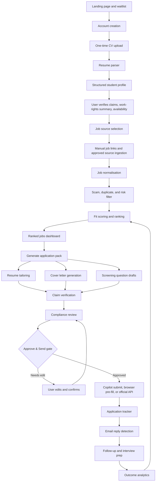
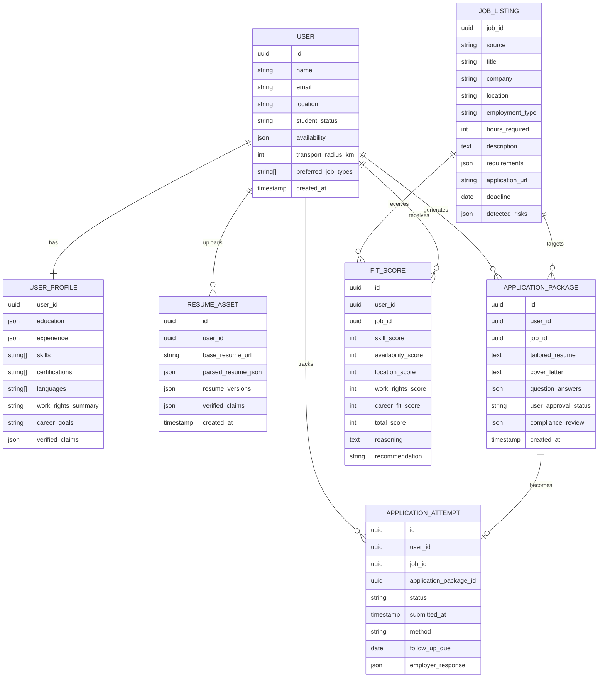

# Employment Automation Copilot MVP Blueprint

## 1. Product thesis

Build an assisted automation SaaS for international students seeking part-time work in Australia. The product is not a blind mass-application bot. It is a consent-based employment copilot that filters jobs, tailors application assets, pre-fills repetitive forms, tracks outcomes, and requires a human-in-the-loop **Approve & Send** gate before any application is submitted.

**MVP promise:** Apply to 20 high-fit jobs in 30 minutes, not 200 random jobs in 20 hours.

The wedge is recurring application fatigue: students repeatedly upload CVs, rewrite answers, and track applications across outdated job-board interfaces every 3 to 6 months. The product wins by making applications faster, safer, higher quality, and measurable.

## 2. Guardrails and compliance scope

This product can help users organise employment information and generate draft application materials, but it must not provide definitive migration or visa advice. Visa advice, PR-pathway interpretation, and individual migration strategy should be routed to a registered migration agent, Australian legal practitioner, or other lawful provider.

Current Australian context to encode as product guardrails:

- Student visa holders should verify their own visa conditions in VEVO before relying on the product.
- Study Australia states that Student visa work hours are generally limited to 48 hours per fortnight while the course is in session, with different treatment for some master's by research and doctoral students.
- The Australian Department of Education states international students have the same workplace rights and protections as other workers and should understand visa rules before working.
- OMARA states only registered migration agents, legal practitioners, or exempt persons can lawfully give immigration assistance in Australia.
- OAIC APP 11 requires reasonable steps to protect personal information from misuse, interference, loss, and unauthorised access, modification, or disclosure, and to destroy or de-identify personal information when no longer needed.

Primary references for the compliance backlog:

- Study Australia Student visa page: https://www.studyaustralia.gov.au/en/plan-your-move/your-guide-to-visas/student-visa-subclass-500.html
- Australian Department of Education international student workplace rights: https://www.education.gov.au/rights-international-students-work
- Department of Home Affairs work restrictions: https://immi.homeaffairs.gov.au/visas/working-in-australia/work-rights-and-exploitation/work-restrictions
- OMARA immigration assistance guidance: https://portal.mara.gov.au/enquiry/knowledgebase/article/KA-01002/en-us
- OAIC APP 11 guidance: https://www.oaic.gov.au/privacy/australian-privacy-principles/australian-privacy-principles-guidelines/chapter-11-app-11-security-of-personal-information

## 3. End-to-end system schematic



## 4. Customer workflow

### 4.1 Onboarding

```text
-------------------------------------------------
| ApplyOS / JobBridge Student                    |
-------------------------------------------------
| Upload CV once                                 |
| [ Upload Resume ]                              |
-------------------------------------------------
| Your job goal                                  |
| [ Hospitality ] [ Retail ] [ Admin ] [ Finance Intern ] |
-------------------------------------------------
| Availability                                   |
| Mon: 4pm-10pm | Tue: unavailable | Weekend: yes |
-------------------------------------------------
| Location                                       |
| Brisbane CBD + 10km                            |
-------------------------------------------------
| Work-rights guardrail                          |
| Student visa / limited hours / user verified   |
-------------------------------------------------
| [ Find suitable jobs ]                         |
-------------------------------------------------
```

### 4.2 Ranked jobs

```text
-------------------------------------------------
| Ranked Jobs                                    |
-------------------------------------------------
| 92% Match | Casual Admin Assistant | South Bank |
| Why: matches Excel, customer service, 15hr/week |
| [Generate Application] [Skip]                  |
-------------------------------------------------
| 86% Match | Retail Assistant | Brisbane CBD    |
| Why: weekend shifts, no experience barrier      |
| [Generate Application] [Skip]                  |
-------------------------------------------------
```

### 4.3 Application package

```text
-------------------------------------------------
| Application Pack                               |
-------------------------------------------------
| Resume version: Admin Assistant v1             |
| Cover letter: Ready                            |
| Questions: 6/6 answered                        |
| Risk flags: None                               |
| [Review] [Edit] [Submit / Pre-fill]            |
-------------------------------------------------
```

## 5. Internal agentic workforce

| Agent | Role | Input | Output | MVP priority |
| --- | --- | --- | --- | --- |
| Founder/PM Agent | Converts market pain into MVP scope | User story, interviews, competitor gaps | Roadmap, feature priorities, user stories | P0 |
| Compliance Agent | Prevents visa, privacy, and platform-risk mistakes | Work-rights summary, application data, job-board rules | Risk flags, consent checks, escalation rules | P0 |
| User Profile Agent | Builds the master applicant profile | CV, LinkedIn, schedule, preferences | Structured user profile and verified claims | P0 |
| CV Intelligence Agent | Parses and normalises CV data | Base resume, user edits | Skills, experience, education, certifications | P0 |
| Job Ingestion Agent | Collects suitable listings | Manual links, approved APIs, career pages | Clean job-listing records | P1 |
| Job Quality Agent | Removes scams, duplicates, and poor-fit jobs | Raw listings | Approved job pool | P0 |
| Fit Scoring Agent | Ranks jobs by probability of success | User profile, job requirements | Score, reasons, risks, recommendation | P0 |
| Application Writer Agent | Generates tailored application documents | Job ad, verified profile | Resume bullets, cover letter, short answers | P0 |
| Claim Verification Agent | Blocks unsupported resume claims | Generated application pack, verified claims | Unsupported claim warnings | P0 |
| Application Executor Agent | Assists with safe submission | Approved application pack | Draft, browser pre-fill, or official API submission | P1 |
| CRM Agent | Tracks every employer interaction | Applications, email replies, user updates | Status board and reminders | P0 |
| Interview Agent | Prepares user after callbacks | Job description, application pack | Questions, STAR scripts, practice checklist | P1 |
| Growth/Data Agent | Learns what works | Scores, outcomes, callbacks, offers | Better source allocation and scoring weights | P2 |
| Security Agent | Protects personal data | CVs, contact details, visa status, logs | Access controls, audit logs, retention actions | P0 |

## 6. Automation boundaries

| Mode | Description | When to use | MVP stance |
| --- | --- | --- | --- |
| Mode 1: Copilot mode | Generate application pack; user manually submits | Launch MVP and early pilots | Required |
| Mode 2: Browser-extension mode | User-controlled pre-fill for repetitive forms | Repetitive job-board forms | Build after core workflow validates |
| Mode 3: Official API submission mode | Submit through partner-approved APIs | Scale and enterprise partnerships | Later roadmap |

Never optimise for a hidden bot that submits hundreds of applications without explicit user consent. The defensible product is a workflow assistant with quality thresholds, application caps, audit logs, and a mandatory approval checkpoint.

## 7. V1 scope

### 7.1 V1 in

| Feature | Why it matters |
| --- | --- |
| One-time CV upload | Removes repeated data entry |
| Structured student profile | Stores availability, location, skills, preferences, and user-verified work-rights summary |
| Manual job link ingestion | Avoids overbuilding fragile scraping before product-market validation |
| Job search dashboard | Replaces outdated browsing with a ranked shortlist |
| Job fit scoring | Prevents blind mass applications |
| Resume tailoring | Increases relevance per role |
| Cover letter and short-answer generation | Removes repetitive writing burden |
| Human approval before submission | Reduces legal, ethical, and platform risk |
| Application tracker | Solves the “where did I apply?” problem |
| Follow-up generator | Improves response discipline |
| Interview prep pack | Extends value after callback |
| Download/delete data controls | Builds trust and supports privacy obligations |

### 7.2 V1 out

| Feature | Why delay it |
| --- | --- |
| Fully autonomous 500-job submission | High spam, low quality, likely platform-risk |
| Deep PR-pathway calculator | Could become regulated migration advice |
| Full ATS integration network | Partnership-heavy and slow |
| Employer marketplace | Two-sided marketplace is too slow for ASAP MVP |
| Complex scraping engine | Fragile, maintenance-heavy, and terms-of-service risky |
| Automated visa eligibility decisions | High compliance risk and not needed for employment MVP |

## 8. Core data model



## 9. Suggested MVP tech stack

| Layer | Recommended option | Reason |
| --- | --- | --- |
| Frontend | Next.js React app | Fast SaaS delivery and Vercel deployment |
| Backend | Supabase | Auth, Postgres, storage, row-level security, and rapid prototyping |
| Database | PostgreSQL | Relational fit for user, job, and application entities |
| Vector search | pgvector | Match resumes, skills, and job descriptions |
| Auth | Supabase Auth or Clerk | Low-friction identity management |
| File storage | Supabase Storage or S3 | CV and generated document storage |
| Agent orchestration | LangGraph or CrewAI | Explicit, inspectable agent workflow |
| LLM | GPT-5.5 with fallback provider abstraction | Strong reasoning and generation, with future model portability |
| Browser assist | Chrome extension | User-controlled pre-fill instead of hidden botting |
| Email integration | Gmail API first, SendGrid for transactional mail | Reply tracking and follow-up drafts |
| Analytics | PostHog | Funnel, retention, and event analytics |
| Payments | Stripe | Subscriptions and application packs |
| Deployment | Vercel plus Supabase | Fast MVP operations |

## 10. Deterministic workflow with agent steps

Do not start with a complex autonomous agent. Build a deterministic workflow, then place agents inside each stage.

```text
Input → Parse → Verify → Match → Generate → Review → Approve → Submit/Assist → Track → Learn
```

| Stage | Deterministic action | Agent action | Human gate |
| --- | --- | --- | --- |
| Input | Store CV and preferences | Extract profile fields | User confirms profile |
| Parse | Convert resume and job ads to JSON | Normalise skills and requirements | User fixes parsing errors |
| Verify | Mark claims as verified/unverified | Identify unsupported claims | User confirms disputed claims |
| Match | Calculate base rule scores | Explain fit and risks | User chooses jobs |
| Generate | Produce documents | Tailor resume, cover letter, Q&A | User reviews drafts |
| Review | Run compliance checklist | Block risks or request confirmation | User approves |
| Submit/Assist | Open link, pre-fill, or API submit | No hidden submission | User clicks final send unless official API consent applies |
| Track | Save status and reminders | Detect replies and draft follow-ups | User sends follow-up |
| Learn | Store outcomes | Improve scoring and templates | User can delete data |

## 11. Agent prompt stack

### 11.1 Job Fit Agent

```text
You are the Job Fit Agent. Compare the user's structured profile against the job listing.
Score the job across:
1. skills match
2. experience match
3. availability match
4. location/commute match
5. work-rights compatibility based only on the user-provided work-rights summary
6. career pathway relevance
7. likelihood of response

Return:
- total score out of 100
- 5 reasons for fit
- 3 risks
- recommendation: apply, save, or skip
- fields requiring user confirmation

Rules:
- Do not provide visa advice.
- Do not infer protected attributes.
- Prefer high-fit jobs over application volume.
```

### 11.2 Resume Tailoring Agent

```text
You are the Resume Tailoring Agent. Rewrite the user's resume for this role without inventing experience.
Use only verified user claims.
Prioritise keywords from the job ad.

Output:
- revised profile summary
- 5 tailored bullet points
- skills section
- warning list for unsupported claims
- concise rationale for changes

Rules:
- Never add qualifications, licences, work rights, employers, dates, or achievements not present in verified_claims.
- If the job requires a licence or certification the user has not verified, flag it.
```

### 11.3 Application Answer Agent

```text
You are the Application Answer Agent. Answer employer screening questions using the user's verified profile.

Rules:
- Never invent qualifications, licences, availability, work rights, or experience.
- Flag questions that require user confirmation.
- Keep answers concise, direct, and employer-friendly.
- If a question asks for sensitive personal information, explain why user review is required.
```

### 11.4 Compliance Agent

```text
You are the Compliance Agent. Review the application before submission.

Check:
- unsupported claims
- visa/work-hours risk based only on the user's own stated visa/work-rights summary
- missing user consent
- privacy-sensitive disclosures
- platform-risk behaviour
- discriminatory or inappropriate content
- application volume and quality thresholds

Return:
- approved / blocked / needs user review
- reason
- required user action
- audit log summary

Rules:
- Do not give migration advice.
- If visa interpretation is required, route to registered migration agent or legal practitioner.
- No application can be submitted without explicit user approval.
```

## 12. Security, privacy, and trust controls

| Risk | Control |
| --- | --- |
| Visa/work-rights misuse | Work-hours guardrail, disclaimer, VEVO reminder, migration-agent referral |
| Bad applications sent without consent | Mandatory Approve & Send checkpoint |
| Platform terms breach | Use official APIs where possible; browser extension only under user control |
| Personal data leakage | Encryption, row-level security, least-privilege roles, audit logs |
| Over-retention of CVs and documents | Download/delete data button and retention policy |
| Hallucinated resume claims | Claim Verification Agent and unsupported-claim warnings |
| Spam-like behaviour | Daily application cap and quality threshold |
| Discrimination risk | Do not infer protected attributes; let users control disclosure |
| Prompt injection from job ads | Treat job descriptions as untrusted data and isolate tool instructions |
| Sensitive visa data exposure | Store only a user-written work-rights summary unless legally reviewed |

## 13. MVP delivery roadmap

### Sprint 1: Core proof of value

| Output | Description |
| --- | --- |
| Landing page | Problem, promise, waitlist, student-focused positioning |
| User onboarding form | CV upload, availability, location, job preferences |
| Resume parser | Extract education, experience, skills, certifications |
| Manual job ingestion | Paste job links or job descriptions |
| Fit scoring prototype | Rank jobs against CV and availability |
| Application generator | Resume bullets, cover letter, and short answers |

**Goal:** A user can upload a CV once and produce high-quality applications quickly.

### Sprint 2: Workflow automation

| Output | Description |
| --- | --- |
| Job ingestion worker | Pulls from approved sources or user-pasted links |
| Browser extension prototype | Pre-fills common fields while user stays in control |
| Gmail tracking | Detects employer replies and status changes |
| Follow-up generator | Drafts polite follow-up emails |
| Interview prep generator | Creates role-specific interview scripts |

**Goal:** Reduce repetitive application effort by 70-80%.

### Sprint 3: Pilot-ready SaaS

| Output | Description |
| --- | --- |
| Stripe payments | Subscription or pay-per-application packs |
| Admin panel | Review usage, failures, and application outcomes |
| Privacy controls | Download/delete my data |
| Audit logs | Track what AI generated and what the user approved |
| Referral loop | Student ambassadors and university clubs |
| Outcome dashboard | Applications, callbacks, interviews, offers |

**Goal:** Pilot with 20-50 international students.

## 14. Build order for ASAP MVP

1. Landing page and waitlist.
2. CV upload plus structured profile.
3. Manual job link/parser.
4. Fit scoring.
5. Tailored resume, cover letter, and Q&A generator.
6. Claim verification and compliance review.
7. Application tracker.
8. Follow-up generator.
9. Browser extension pre-fill.
10. Approved-source job ingestion.
11. Outcome analytics.
12. Subscription and payment layer.

## 15. Pricing hypothesis

| Plan | Price | Offer |
| --- | ---: | --- |
| Free | $0 | CV upload, 5 job scores, 1 application pack |
| Student | $19-29/month | 50 job scores, 20 application packs, tracker |
| Pro | $49/month | 100+ jobs, browser extension, follow-ups, interview prep |
| Pay-per-pack | $3-5/application | One-off tailored application |

International students are price-sensitive, so the wedge should be affordability plus visible time saved. The initial paid metric should be application packs generated and tracked, not unlimited submissions.

## 16. MVP moat

The moat is not “AI writes cover letters.” The moat is the closed-loop employment engine.

| Signal | Product advantage |
| --- | --- |
| Which roles respond to international students | Better targeting |
| Which CV versions get callbacks | Better resume optimisation |
| Which job boards produce results | Better source allocation |
| Which employers are student-friendly | Employer intelligence database |
| Which roles fit limited availability | Higher success rate |
| Which application questions cause drop-off | Better automation and UX |

## 17. Definition of done for commercial MVP

The first commercial MVP is ready when a student can:

1. Upload a CV once.
2. Verify their profile and availability.
3. Paste or import job listings.
4. See ranked student-friendly jobs with clear fit reasons and risks.
5. Generate a tailored application pack.
6. Review unsupported claims and compliance flags.
7. Approve, copy, download, pre-fill, or submit through an approved path.
8. Track each application through callback, interview, offer, rejection, or no response.
9. Delete or export their personal data.

Final positioning:

> Upload your CV once. Get a ranked shortlist of student-friendly jobs. Generate tailored applications in one click. Track everything until interview.
